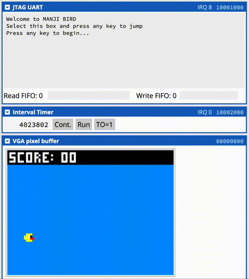

Flappy Bird for the Altera DE0. Created for individual learning benefit. Named
after the great prof Dr. Naraig Manjikian.

https://cpulator.01xz.net/?sys=nios-de0&loadasm=share/sOZ5Wfc.s&lang=c

The flickering is likely due to the limitations of the web based tool, a real
board doesn't have these problems.

